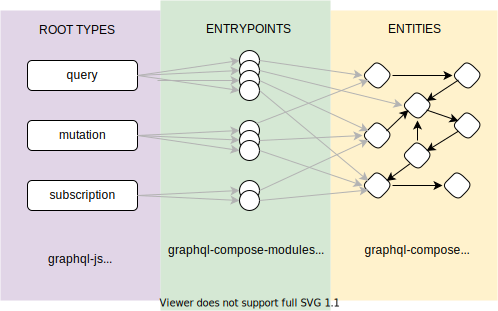
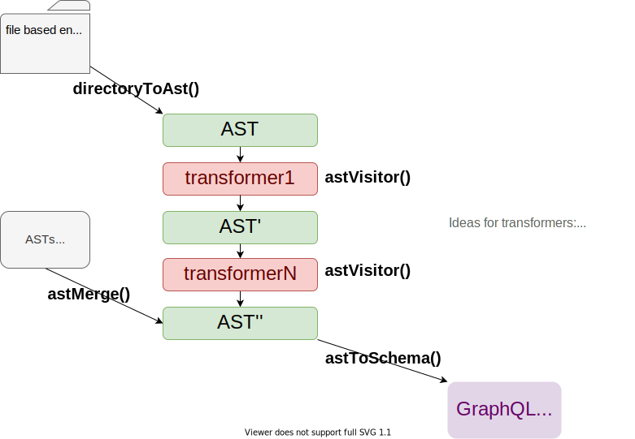

# graphql-compose-modules

[](https://www.npmjs.com/package/graphql-compose-modules)
[](https://codecov.io/github/graphql-compose/graphql-compose-modules)
[](https://github.com/graphql-compose/graphql-compose-modules/actions)
[](http://www.npmtrends.com/graphql-compose-modules)
[](http://commitizen.github.io/cz-cli/)

[](#backers)
[](#sponsors)

This is a toolkit for creating big GraphQL schemas with code-first approach in JavaScript.

## Quick demo

You may find a simple GraphQL server example in the following folder: [examples/simple](./examples/simple).

## GraphQL schema entrypoints from a file structure

When you are using code-first approach in GraphQL Schema construction you may meet with problem when you cannot understand what entrypoints has your schema. And where exactly placed the code which serves this or that entrypoint.



`graphql-compose-modules` uses a file-system based schema entrypoint definition (something like does NextJS with its pages concept for routing). You just create folder `schema/` and put inside it the following sub-folders (root directories): `query`, `mutation` and `subscription`. Inside these folders you may put `.js` or `.ts` files with FieldConfigs. Assume you create the following directory structure:

```bash
schema/
  query/
    articleById.ts
    articlesList.ts
  mutation/
    createArticle.ts
    updateArticle.ts
    removeArticle.ts
  subscription/
    onArticleChange.ts
```

With this directory structure `graphql-compose-modules` will use file names as field names for your root types and you get the following GraphQL schema:

```graphql
type Query {
  articleById: ...
  articlesList: ...
}

type Mutation {
  createArticle: ...
  updateArticle: ...
  removeArticle: ...
}

type Subscription {
  onArticleChange: ...
}
```

If you want rename field `articlesList` to `articleList` in your schema just rename `articlesList.ts` file. If you want to add a new field to Schema – just add a new file to `Query`, `Mutation`, `Subscription` folders. **This simple approach helps you understand entrypoints of your schema without launching the GraphQL server – what you see in folders that you get in GraphQL Schema**.

## Describing Entrypoints in files

Every Entrypoint (FieldConfig definition) is described in separate file. This file contains all information about input args, output type, resolve function and additional fields like description & deprecationReason. As an example let's create `schema/Query/sum.ts` and put inside the following content:

```ts
export default {
  type: 'Int!',
  args: {
    a: 'Int!',
    b: 'Int!',
  },
  resolve: (source, args, context, info) => {
    return args.a + args.b;
  },
  description: 'This method sums two numbers',
  deprecationReason: 'This method is deprecated and will be removed soon.',
  extensions: {
    someExtraParam: 'Can be used for AST transformers',
  },
};
```

If you familiar with [graphql-js FieldConfig definition](https://graphql.org/graphql-js/type/#examples) then you may notice that `type` & `args` properties are defined in SDL format. This syntax sugar provided by [graphql-compose](https://github.com/graphql-compose/graphql-compose#examples) package.

## Entrypoints with namespaces for big schemas

If your GraphQL Schema has a lot of methods you may create sub-folders for grouping some entrypoints fields according to some Entity or Namespace:

```bash
schema/
  query/
    articles/
      byId.ts
      list.ts
    ...
  mutation/
    articles/
      create.ts
      update.ts
      remove.ts
    ...
```

With such structure you will get the following schema. Namespace types `QueryArticles` & `MutationArticles` are created automatically:

```graphql
type Query {
  articles: QueryArticles
}

type Mutation {
  articles: MutationArticles
}

type QueryArticles {
  byId: ...
  list: ...
}

type MutationArticles {
  create: ...
  update: ...
  remove: ...
}
```

You may use sub-folders for `Query` & `Mutation` and all servers supports this feature. But for `Subscription` most current server implementations (eg. [apollo-server](https://www.apollographql.com/docs/apollo-server/data/subscriptions/)) does not support this yet.

## API



For now I provide basic overview of available API methods and I will describe them later.

### Main API method:

- `buildSchema(module: NodeModule, opts: BuildOptions): GraphQLSchema` – use this method for creating graphql schema

### Advanced API methods:

The following methods helps to use schema composition, applying middlewares and schema transformation via visitor pattern:

- `loadSchemaComposer(module: NodeModule, options: BuildOptions): SchemaComposer` – construct SchemaComposer from folder (uses `directoryToAst` & `astToSchema` methods under the hood)
- `directoryToAst(module: NodeModule, options: DirectoryToAstOptions): AstRootNode` – traverses directories and construct AST for your graphql entrypoints
- `astToSchema(ast: AstRootNode, opts: AstToSchemaOptions): SchemaComposer` – converts AST to GraphQL Schema
- `astMerge(...asts: Array<AstRootNode>): AstRootNode` – combines several ASTs to one AST (helps compose several graphql schemas)
- `astVisitor(ast: AstRootNode, visitor: AstVisitor): void` – modify AST via visitor pattern
